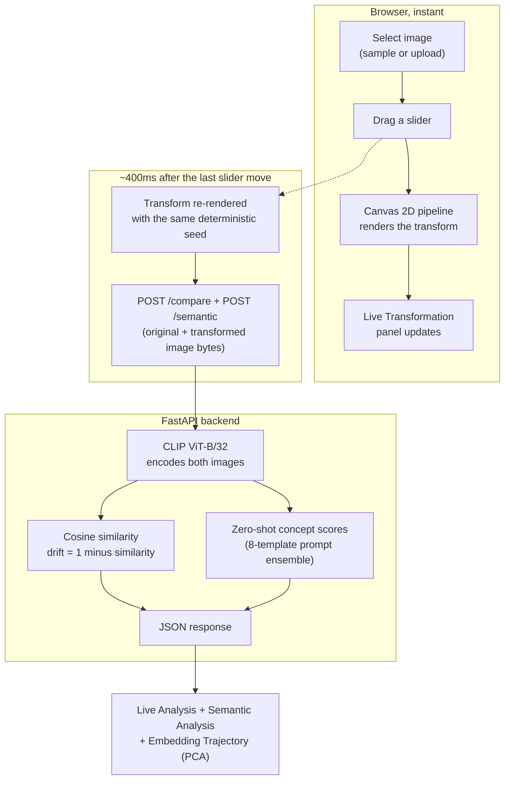
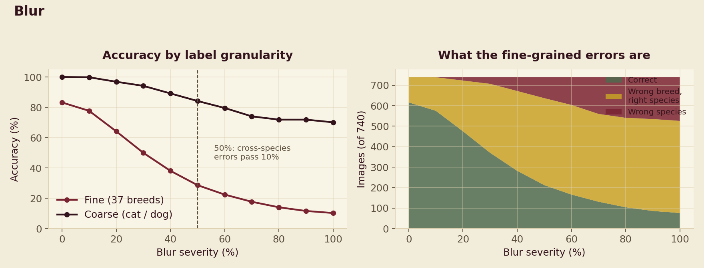
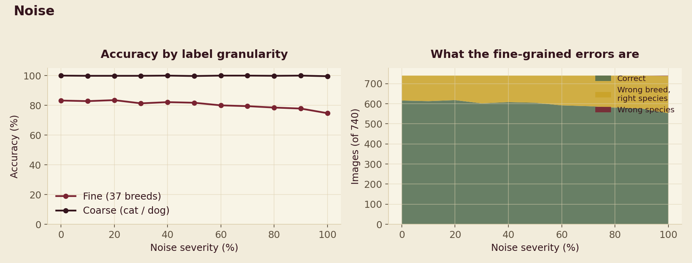
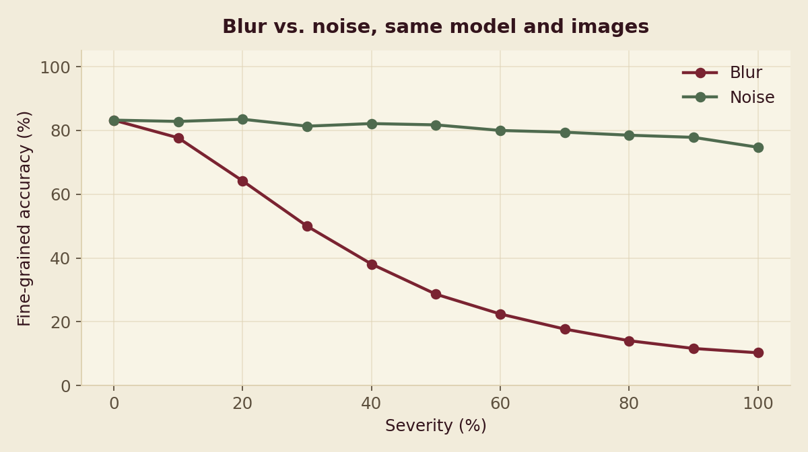

# PRISM

An interactive tool for studying how CLIP's image representations change under controlled visual
corruption, plus a real offline dataset experiment that asks a question the usual robustness
benchmarks don't.

[CLIP](https://openai.com/research/clip) can identify what's in an image zero-shot, using only text
prompts. I wanted to know how stable that ability is when the image itself is degraded. Pick an image,
drag a slider, and CLIP re-encodes the result in real time. Every number on screen comes from an actual
forward pass through the model running locally. The dataset study further down this README reports
real numbers from a real experiment.


---

## What it does

CLIP converts an image into an embedding: a list of 512 numbers describing what the model believes the
image is about. Two images the model considers similar produce embeddings that sit close together in
that 512-dimensional space. Two images it considers different produce embeddings that sit far apart.

PRISM has two parts.

The first is a live tool. Pick an image, apply a real visual transformation (blur, noise, brightness,
contrast, rotation, JPEG compression), and PRISM sends both the original and transformed image through
CLIP, measures cosine similarity and drift, and shows the result immediately. A Robustness Sweep runs
one perturbation across 11 fixed severities and reports similarity, confidence, and entropy at each
step, or runs all perturbation types back to back to compare which one moves the representation most,
computing the Spearman correlation between drift and semantic uncertainty on the actual data. A
Semantic Analysis panel runs real CLIP zero-shot classification against a small fixed concept set, so
the tool shows what the model now thinks the image is, not just how far the embedding moved. A Dataset
Benchmark runs the same sweep across a small user-curated set of images instead of a single photo, to
check whether one image's curve is typical. An Embedding Trajectory panel projects every real analysis
result into 2D with PCA, so the path an image's representation traces under perturbation is visible.

The second part is the offline research study described below: a real batch experiment over a labeled
dataset, producing a results CSV and a written finding.

```
ORIGINAL IMAGE
      |
      v
USER ADJUSTS A TRANSFORM (blur / noise / brightness / contrast / rotation / compression)
      |
      v
CLIP ViT-B/32 INFERENCE ON BOTH IMAGES
      |
      v
COSINE SIMILARITY, DRIFT = 1 MINUS SIMILARITY
      |
      v
LIVE RESULTS (similarity, drift, latency, embedding trajectory, zero-shot concept scores)
```

## How it works



Two implementation details are load-bearing enough to call out directly.

The image the user sees is the exact image that gets analyzed. All six transforms (blur, Gaussian
noise, brightness, contrast, rotation, JPEG compression) run once, client-side, on real pixel data
through the Canvas 2D API. The transformed canvas is encoded to a real PNG or JPEG blob, and that exact
blob is sent to the backend. There is no second, backend-side transform implementation to drift out of
sync with what's on screen. The one exception is the offline research script below, which reimplements
the same blur and noise math in Python for batch processing over a dataset the browser never touches.

There are two independent debounce timers. The live preview re-renders on a 60ms debounce so dragging a
slider feels immediate. The backend call waits 400ms after the last change settles, so a user rapidly
dragging a slider does not flood the API. Verified directly, and re-verified after every round of
changes: 40 rapid slider ticks in a row collapse into exactly one network request.

---

## Research: does CLIP confuse breeds before it confuses species?

Everything above is live and interactive. This section is a real offline batch experiment, structured
like the [CLIP Robustness Study](https://github.com/Eishaan-Khatri/IACV_CLIP_Robustness_Study)
reference project's own scripts, producing a results CSV and a written finding. It asks a question that
project's own setup cannot answer: its label sets (CIFAR-10, CIFAR-100) are single-level, and its
EuroSAT run has no severity sweep at all. The full write-up, raw per-image CSVs, and every script
needed to reproduce this live in [`backend/research/`](backend/research/).

### The question

As corruption severity increases, does CLIP's zero-shot classifier confuse fine-grained distinctions
(breed vs. breed: is this a Persian or a Siamese?) before it confuses coarse-grained ones (cat vs.
dog)? Or does accuracy collapse at both levels together? And does the answer depend on which corruption
is applied?

### Setup

- **Model**: CLIP ViT-B/32, the same load path the live app uses.
- **Two independent zero-shot classifiers**, both using the same 8-template prompt ensembling already
  live in `/semantic`: a 37-way breed classifier and a 2-way cat/dog classifier. Neither is derived
  from the other. Each scores the image on its own.
- **Dataset**: a stratified sample of the real
  [Oxford-IIIT Pet dataset](https://huggingface.co/datasets/timm/oxford-iiit-pet) (CC BY-SA 4.0), 20
  images per breed across 37 breeds, 740 images total. Streamed directly from the dataset's Parquet
  files rather than downloading the full 790MB, because this machine had under 3GB of free disk space
  at the time.
- **Perturbations**: blur and noise, run independently at the live app's own 11 fixed severities (0 to
  100 percent, step 10), using the same parameterization as the browser's canvas pipeline.
- 16,280 total forward passes (740 images, 11 severities, 2 corruption types), about 6 minutes on this
  machine.

### Results

Feature drift is the same formula used everywhere else in PRISM: cosine similarity between clean and
corrupted embeddings. Accuracy is genuinely computable in this study, and nowhere else in the live app,
because Oxford-IIIT Pet comes with real ground-truth labels.

| Severity | Fine accuracy, blur | Coarse accuracy, blur | Fine accuracy, noise | Coarse accuracy, noise |
|---:|---:|---:|---:|---:|
| 0% | 83.2% | 100.0% | 83.2% | 100.0% |
| 20% | 64.2% | 96.9% | 83.5% | 99.9% |
| 50% | 28.7% | 84.2% | 81.8% | 99.7% |
| 80% | 14.1% | 71.9% | 78.5% | 99.9% |
| 100% | 10.3% | 70.1% | 74.7% | 99.6% |

A subset of the real tested severities, for a compact table. Every value here is an actual computed
result. The full 11-point tables are in [`FINDINGS.md`](backend/research/FINDINGS.md).



Left: fine accuracy falls sharply from the first severity step; coarse accuracy degrades far more
slowly. The dashed line marks 50% severity, where cross-species errors first exceed 10% of all images.
Right: the same run's errors, split into three bands from bottom to top: correct, wrong breed but
right species, and wrong species. Below 50% severity almost every error is a within-species confusion.
Above it, the wrong-species band starts to grow.



Left: coarse accuracy stays at or near 100% across the entire severity range. Fine accuracy drifts down
slowly, from 83.2% to 74.7%, with no crossover line because cross-species errors never reach the 10%
threshold used above. Right: the wrong-species band is essentially invisible at every severity, a
direct visual contrast with the blur figure above.



Both curves start at the same clean-accuracy point (83.2%) since they're the same 740 images before any
corruption is applied. The noise curve stays close to flat. The blur curve drops to about a third of
its starting value by 40% severity.

### What I found

Under blur, coarse classification is far more robust than fine classification. By 50% severity, fine
accuracy has already fallen to 28.7%, worse than breed-weighted random guessing, while coarse accuracy
is still 84.2%. Even at maximum blur, coarse accuracy stays above 70% while fine accuracy has collapsed
to 10.3%, barely above the roughly 2.7% chance baseline for 37 classes.

Under noise, this pattern barely appears, and that's the more interesting half of the result. At the
severities tested (additive Gaussian pixel noise, standard deviation up to 45 out of 255), fine accuracy
only drifts from 83.2% to 74.7% across the entire range, coarse accuracy never meaningfully leaves 99 to
100%, and cross-species errors are close to absent: 2 images out of 740, only at maximum severity. The
crossover point blur reaches by 50% severity does not happen for noise within this range.

The fine-before-coarse collapse is specific to how a given corruption damages the image, not a general
property of the model. Blur destroys the local texture and edge detail that fine distinctions depend on
while leaving coarse shape and color information intact for longer. Additive pixel noise at these
severities does not appear to remove that same information the same way. CLIP's embedding seems to
average over per-pixel noise fairly effectively. Whether noise would eventually produce the same pattern
at more extreme severities is an open question this study does not answer.

A secondary observation from the blur run: heavily blurred images do not fail randomly. At 100%
severity, "boxer" alone accounts for about 24% of all wrong fine-grained predictions (161 of 664),
regardless of the image's true breed. Severe blur appears to push many different images' embeddings
into the same narrow region of representation space rather than spreading errors evenly across all 37
breeds.

### Caveats

- 20 images per breed is a real but small sample. The aggregate pattern is more trustworthy than any
  single breed's number.
- Only two corruption types were tested. Whether the same pattern holds for contrast, rotation, or
  compression, all already in the live sweep, is still open.
- The fine and coarse classifiers are independent zero-shot runs, not a hierarchy. A fine prediction
  landing on the wrong species does not by itself determine the coarse classifier's own, separately
  computed, answer for that image.
- The noise result is bounded by the severity range actually tested. It is a real finding within that
  range, not a claim that CLIP is robust to noise at any intensity.

### Reproducing it

```bash
cd backend
pip install -r research/requirements.txt
python research/sample_dataset.py           # streams ~740 images, ~40MB, a few minutes
python research/run_study.py --axis blur    # ~3 minutes, resumable if interrupted
python research/run_study.py --axis noise   # ~3 minutes, resumable if interrupted
python research/build_frontend_data.py      # regenerates the live site's Findings section
python research/make_figures.py             # regenerates the figures above
```

---

## Tech stack

| | |
|---|---|
| ML | PyTorch 2.13, Hugging Face Transformers 5.15, `openai/clip-vit-base-patch32` |
| Backend | FastAPI 0.141, Uvicorn, Pillow, NumPy |
| Frontend | React 19, TypeScript, Vite 8, Tailwind CSS 4 |
| Research scripts | Hugging Face `datasets` (streaming), Matplotlib. Scoped to `backend/research/`, not the live app |
| Model runs | Locally. No external API, no cost per request |

## Architecture

```
backend/
  app/
    main.py                      FastAPI app, CORS, model lifecycle, precomputes concept embeddings
    api/
      analyze.py                  POST /analyze, POST /compare
      project.py                  POST /project (PCA embedding projection)
      semantic.py                 POST /semantic (zero-shot concept scoring)
    services/
      model_service.py            Loads and holds the CLIP model and processor in memory
      embedding_service.py        Runs inference, L2-normalizes embeddings, cosine similarity
      image_service.py            Decodes uploaded bytes into a validated PIL image
      projection_service.py       PCA via SVD, with sign stabilization across calls
      semantic_service.py         8-template prompt ensembling and zero-shot concept scoring
    schemas/                      Pydantic request and response models
    utils/validation.py           File type and size validation, clean error messages
  research/                       Offline dataset study, see the Research section above
    sample_dataset.py             Streams a stratified Oxford-IIIT Pet sample
    run_study.py                  The corruption x severity x label-granularity sweep
    build_frontend_data.py        Aggregates results into the live site's data file
    make_figures.py               Renders the figures above
    FINDINGS.md                   Full write-up

frontend/
  src/
    App.tsx                       Orchestrates state: image selection, transform, dual debounce
    lib/imageTransform.ts         The canvas-based transform pipeline
    lib/statistics.ts             Spearman correlation, used by the live Robustness Sweep
    hooks/                        useDebouncedValue, useRobustnessSweep, useDatasetBenchmark, ...
    api/client.ts                 Typed fetch wrappers for every endpoint
    components/                   Image panels, sliders, analysis panels, RobustnessSweep,
                                   SemanticAnalysis, DatasetBenchmark, EmbeddingTrajectory,
                                   ResearchFindings
    data/petStudyResults.ts       Generated from the offline study, not hand-typed
```

The backend does not contain a second live-request transform implementation. See "the image the user
sees is the exact image that gets analyzed" above. The offline research script is the one documented
exception, since it processes a batch dataset rather than a live request.

## API

The model loads once at process startup and stays resident in memory. Every request reuses it.

| Method | Path | What it does |
|---|---|---|
| GET | `/health` | Model load state and inference device (cpu, mps, or cuda) |
| POST | `/analyze` | One image in, its 512-dimension CLIP embedding out |
| POST | `/compare` | Two images in, cosine similarity, drift, and both embeddings out |
| POST | `/project` | A set of embeddings in, PCA-projected 2D points out, sign-stabilized across calls |
| POST | `/semantic` | One image in, CLIP zero-shot scores against a fixed concept set, plus confidence and entropy |

`device` auto-detects Apple Silicon GPU (mps), then CUDA, then CPU, so the same code runs unmodified on
a Mac, a CUDA box, or a plain CPU machine.

## Problems solved along the way

A few things came up during development worth documenting, because they are the kind of bugs that only
surface when testing against a real model and a real browser instead of assuming the happy path.

- `CLIPModel.get_image_features()` and `get_text_features()`, in the installed `transformers` version,
  return a `BaseModelOutputWithPooling` wrapper object rather than the raw embedding tensor older
  tutorials assume. The real embedding is at `.pooler_output`. Caught by testing with a real image
  rather than trusting that the code compiled.
- The live preview and the backend-analysis pipeline render the transform independently, on different
  debounce timings, and the noise transform uses randomness. With `Math.random()`, the two renders
  produced different noise patterns, silently breaking "the image the user sees is the image that gets
  analyzed." Fixed with a seeded `mulberry32` PRNG so the same image and transform settings always
  produce byte-identical output.
- A CSS `overflow-hidden`, added to panel containers to clip their rounded corners around edge-to-edge
  images, was also clipping any tooltip that needed to render outside its panel's bounds. Invisible
  until a label happened to sit near a panel's edge. Fixed by moving the clipping to just the image
  wrapper that needed it, and making the tooltip measure and clamp itself against the actual viewport.
- A truncated PNG makes PIL raise a plain `OSError`, not the `UnidentifiedImageError` the first version
  of the decoder caught. The difference is a clean 400 response versus a raw 500 leaking a stack trace
  to the client. Found by deliberately testing a corrupted file, not by inspecting the code.
- Muted-text and accent colors that looked fine by eye against the background measured under the 4.5:1
  WCAG AA threshold for normal text, more than once across this project's several palette changes.
  Fixed each time by computing actual relative luminance and adjusting the palette, not by guessing.
- Switching to a new image while a previous analysis was mid-flight, or had just failed, left the old
  image's similarity and drift numbers on screen next to the new image, easy to misread as current
  data. Fixed by clearing analysis state the instant a new image is selected.

## Running locally

**Backend**
```bash
cd backend
python3 -m venv .venv && source .venv/bin/activate
pip install -r requirements.txt
uvicorn app.main:app --reload --port 8000
```
The first run downloads CLIP's weights from Hugging Face (about 600MB) and caches them locally.
Subsequent starts are fast.

**Frontend**
```bash
cd frontend
npm install
npm run dev -- --port 5175
```
Open `http://localhost:5175`. The backend's CORS is configured for this exact port.

**Offline research study** (optional, see the Research section above for what it produces)
```bash
cd backend
pip install -r research/requirements.txt
python research/sample_dataset.py
python research/run_study.py --axis blur
python research/run_study.py --axis noise
```

## Testing

There is no automated test suite. The full flow, including every feature added after the original MVP,
was verified manually against a running backend, including these cases:

- Model loads once at startup and stays resident across requests.
- An image compared against itself gives similarity 1.0, drift 0.0.
- Genuinely different images give proportional, real drift.
- A wrong file type, a corrupted file, and an oversized file (over 10MB) each give a clean 400
  response, not a stack trace.
- Killing the backend mid-session makes the frontend show an offline state and a plain error message,
  without crashing, and it self-heals when the backend returns.
- 40 rapid slider changes produce exactly one backend request per endpoint touched, re-verified after
  every round of changes to the sweep and benchmark logic.
- Rapid image switching settles cleanly on the last selection, with no mismatched stale data.
- The Robustness Sweep's "Compare all" makes real sequential calls per axis, confirmed in the network
  log, not simulated.
- The Dataset Benchmark makes real per-image, per-severity calls across every image in the set.
- The offline research script is resumable: re-running it after an interruption skips already-completed
  rows, verified by interrupting and restarting mid-run.

## Limitations

- Only one model is wired up, `openai/clip-vit-base-patch32`. Comparing across multiple models is a
  natural extension, not built here.
- The first request after startup is slower. MPS (Apple GPU) kernels JIT-compile on first use, so
  expect 400 to 500ms on the first inference after the backend starts, then 50 to 150ms after that.
- Comparing an image against its own untouched self reads about 99.9% similarity rather than a perfect
  100.0%, because every image is resized to a 1024px cap for consistent performance before analysis.
  That resize introduces a small sub-pixel interpolation difference even at zero transform intensity.
- The embedding trajectory is a real PCA projection, but only relative positions between points are
  meaningful. The axes themselves do not correspond to anything interpretable.
- Semantic Analysis and the Robustness Sweep score against a small fixed set of six concepts. This is a
  real zero-shot classification, not a general-purpose one.
- The offline research study has its own stated limits: a small per-breed sample size, and only two
  corruption types tested. They are listed in full in its own Caveats section above.
- There are no accounts, no server-side persistence, and no database. This is a single-session
  exploration tool, not a multi-user product. Experiment history lives in memory for the browser
  session only.

PRISM shows how a model's image representations change under controlled visual transformations, and
reports one real offline experiment that goes further. It does not explain why the model responds the
way it does, and it is not a claim about how vision models think in general.
