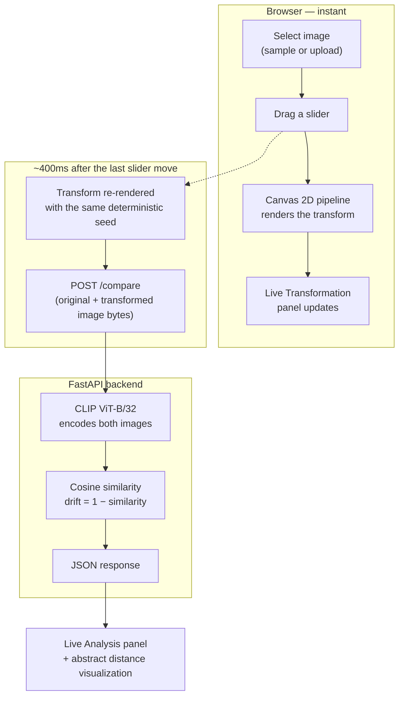

# PRISM

**An interactive tool for exploring how a real AI vision model's understanding of an image changes as you distort it.**

Pick an image, drag a slider, and watch [CLIP](https://openai.com/research/clip) — the vision-language model behind a lot of modern image search and generation — re-encode your changes in real time. Every number on screen comes from an actual forward pass through the model running locally. Nothing here is randomized, hardcoded, or simulated.


<!--
  Add a real screenshot or short GIF here before sharing this repo —
  run the app locally (see below), select a sample image, drag a
  couple of sliders, and screenshot the result. A live demo sells
  this project far better than a paragraph of description.

  
-->

---

## What it does

A vision model like CLIP doesn't "see" pixels the way we do — it converts an image into an **embedding**, a list of 512 numbers that captures what the model believes the image is *about*. Two images that look similar to the model produce embeddings that sit close together in that 512-dimensional space; two images the model considers very different produce embeddings that sit far apart.

PRISM makes that abstract idea tangible. You choose an image, apply a real visual transformation — blur, noise, a brightness shift, a rotation, JPEG compression — and PRISM sends both the original and the transformed image through CLIP, measures how far apart their embeddings landed, and shows you the result live.

```
ORIGINAL IMAGE
      │
      ▼
USER ADJUSTS A TRANSFORM (blur / noise / brightness / rotation / compression)
      │
      ▼
REAL CLIP ViT-B/32 INFERENCE  (on both images, in the backend)
      │
      ▼
COSINE SIMILARITY  →  DRIFT = 1 − SIMILARITY
      │
      ▼
LIVE RESULTS  (similarity %, drift %, latency, an abstract distance visualization)
```

## How it works



Two things make this architecture worth calling out:

**The image you see is the exact image that gets analyzed.** All five transforms (blur, Gaussian noise, brightness, rotation, JPEG compression) are implemented once, client-side, using the Canvas 2D API on real pixel data — not CSS filters pretending to be transforms. The transformed canvas is encoded to a real PNG or JPEG blob and *that exact blob* is what's sent to the backend. There's no second, backend-side transform implementation that could quietly drift out of sync with what's on screen.

**Two independent debounce timers, not one.** The live preview re-renders on a short ~60ms debounce so dragging a slider feels immediate. The actual backend call waits ~400ms after the last change settles, so a user furiously dragging a slider doesn't flood the API — verified directly: 40 rapid slider ticks in a row collapse into exactly **1** network request, not 40.

## Try it: the core loop

| Similarity | Drift | What happened |
|---|---|---|
| **100.0%** | **0.0%** | An image compared against itself — the floor |
| **94.9%** | **5.1%** | A moderate Gaussian blur |
| **69.7%** | **30.3%** | Replaced with a visually unrelated image |

These are real numbers from real test runs against the running backend, not invented examples.

## Tech stack

| | |
|---|---|
| **ML** | PyTorch 2.13, Hugging Face Transformers 5.15, `openai/clip-vit-base-patch32` |
| **Backend** | FastAPI 0.141, Uvicorn, Pillow |
| **Frontend** | React 19, TypeScript, Vite 8, Tailwind CSS 4 |
| **Model runs** | Locally — no OpenAI/Claude/Gemini API, no cost per request, no external inference calls |

## Architecture

```
backend/
  app/
    main.py                    FastAPI app, CORS, model lifecycle (loads CLIP once at startup)
    api/
      analyze.py                POST /analyze, POST /compare
    services/
      model_service.py          Loads & holds the CLIP model + processor in memory
      embedding_service.py      Runs inference, L2-normalizes embeddings, cosine similarity
      image_service.py          Decodes uploaded bytes into a validated PIL image
    schemas/
      requests.py, responses.py Pydantic models for the API contract
    utils/
      validation.py             File type / size validation, clean error messages

frontend/
  src/
    App.tsx                     Orchestrates state: image selection, transform, dual debounce
    lib/imageTransform.ts       The canvas-based transform pipeline (see below)
    hooks/useDebouncedValue.ts  Generic debounce hook (used at two different delays)
    api/client.ts               Typed fetch wrapper for /health and /compare
    components/                 Header, image panels, sliders, analysis panel, distance viz
```

The backend deliberately does **not** contain a second transform implementation — see "The image you see is the exact image that gets analyzed" above for why.

## API

The model loads once at process startup and stays resident in memory; every request reuses it.

**`GET /health`**
```json
{
  "status": "ok",
  "model": "openai/clip-vit-base-patch32",
  "model_ready": true,
  "device": "mps"
}
```

**`POST /compare`** — multipart form with `original` and `transformed` image files
```json
{
  "similarity": 0.9494,
  "drift": 0.0506,
  "latency_ms": 51.69,
  "embedding_dimension": 512,
  "model": "openai/clip-vit-base-patch32"
}
```

`device` auto-detects Apple Silicon GPU (`mps`) → CUDA → CPU, in that order, so the same code runs unmodified on a Mac, a CUDA box, or a plain CPU machine.

## Interesting problems solved along the way

A few things came up during development that are worth documenting, because they're the kind of bugs that only surface when you actually test against a real model and a real browser instead of assuming the happy path:

- **A breaking API change in `transformers`.** `CLIPModel.get_image_features()` in the installed version returns a `BaseModelOutputWithPooling` wrapper object, not the raw embedding tensor older tutorials assume — the real embedding is at `.pooler_output`. Caught immediately by testing with a real image instead of trusting the code compiled.
- **Non-deterministic noise breaking the consistency invariant.** The live preview and the backend-analysis pipeline render the transform independently (different debounce timings), and the noise transform uses randomness. With `Math.random()`, the two renders would produce *different* noise patterns — silently violating "what you see is what gets analyzed." Fixed with a seeded `mulberry32` PRNG so the same `(image, transform settings)` pair always produces byte-identical output.
- **Uncaught exception type on corrupted uploads.** A truncated PNG makes PIL raise a plain `OSError`, not the `UnidentifiedImageError` the first version of the decoder caught — the difference between a clean 400 response and a raw 500 leaking a stack trace to the client. Found by deliberately testing a corrupted file, not by inspecting the code.
- **Failed WCAG contrast checks.** The initial muted-text and accent-red colors looked fine by eye against the paper background but measured ~3.6:1 and ~3.1:1 — both under the 4.5:1 AA threshold for normal text. Fixed by computing actual relative luminance and adjusting the palette, not by guessing.
- **Stale state after a failed request.** Switching to a new image while a previous analysis was mid-flight (or had just failed) left the *old* image's similarity/drift numbers on screen next to the *new* image — easy to misread as current data. Fixed by clearing analysis state the instant a new image is selected.

## Design

The brief for this project was explicit: no purple-gradient AI dashboard, no card-heavy admin-panel look, no decorative charts. The interface is built around two large image panels and a narrow numeric readout — the transformation itself is the point, so it gets the space. Typography (Space Grotesk / Inter / JetBrains Mono) and a restrained near-black/near-white palette do the work that icons and shadows usually do elsewhere.

## Running locally

**Backend**
```bash
cd backend
python3 -m venv .venv && source .venv/bin/activate
pip install -r requirements.txt
uvicorn app.main:app --reload --port 8000
```
The first run downloads CLIP's weights from Hugging Face (~600MB) and caches them locally — subsequent starts are fast.

**Frontend**
```bash
cd frontend
npm install
npm run dev -- --port 5175
```
Open `http://localhost:5175`. The backend's CORS is configured for this exact port.

## Testing

There's no automated test suite (out of scope for the MVP), but the full flow was verified manually against a running backend, including the edge cases:

- ✅ Model loads once at startup, stays resident across requests
- ✅ Identical image vs. itself → similarity = 1.0, drift = 0.0
- ✅ Genuinely different images → proportional, real drift
- ✅ Wrong file type, corrupted file, oversized file (>10MB) → clean 400 responses, no stack traces
- ✅ Backend killed mid-session → frontend shows "Offline" and a friendly error, doesn't crash, self-heals when the backend returns
- ✅ 40 rapid slider changes → exactly 1 backend request (debounce verified by instrumenting `fetch` directly, not by eyeballing the network tab)
- ✅ Rapid image-switching (4 images in ~300ms) → settles cleanly on the last selection, no mismatched stale data

## Limitations

Being direct about what this is and isn't:

- **One model.** Only `openai/clip-vit-base-patch32` is wired up. Comparing across multiple models is a natural extension, not built here.
- **First request after startup is slower.** MPS (Apple GPU) kernels JIT-compile on first use — expect ~400–500ms on the very first inference after the backend starts, then ~50–150ms after that.
- **A ~0.1% baseline "noise floor."** Comparing an image against its own untouched self reads ~99.9%/0.1% rather than a perfect 100.0%/0.0%, because every image is resized to a 1024px cap for consistent performance before analysis — that resize introduces a tiny sub-pixel interpolation difference even at zero transform intensity.
- **The distance visualization is intentionally abstract.** It is not a literal projection of CLIP's 512-dimensional space (that's what PCA/UMAP would be, and is explicitly out of scope for this MVP) — it's a monotonic, honest function of the real drift value, amplified with a square root so small drift stays visible.
- **No accounts, no persistence, no database.** By design — this is a single-session exploration tool, not a multi-user product.

PRISM provides an interactive way to observe how a model's image representations change under controlled visual transformations. It does not explain *why* the model responds the way it does, and it isn't a claim about how vision models "think" in general.
