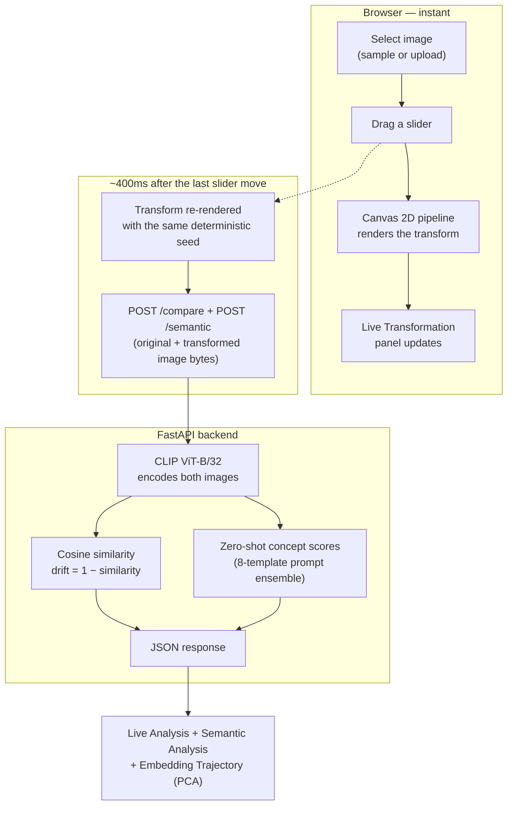
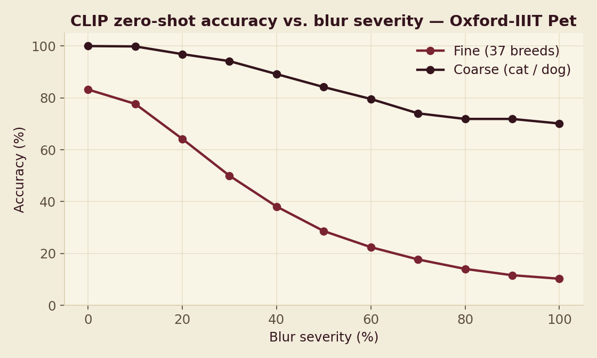
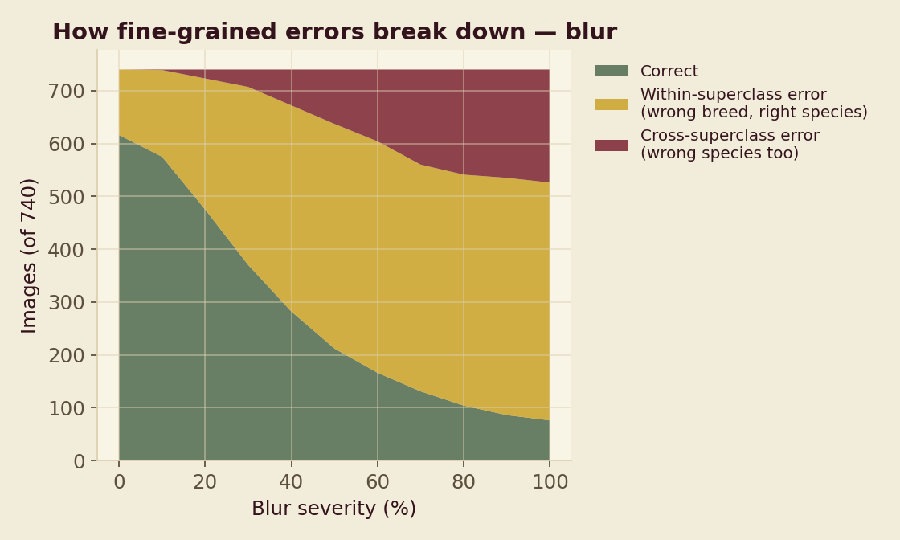
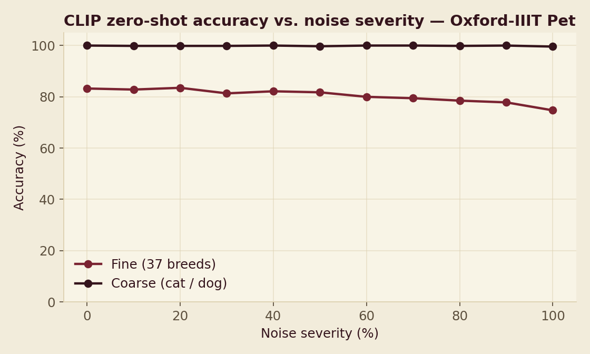
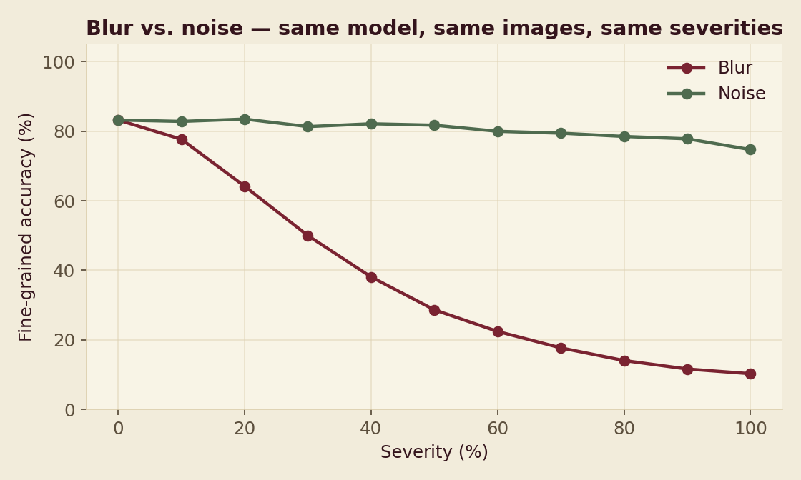

# PRISM

**An interactive laboratory for studying how a real vision-language model's understanding of an image
changes under controlled visual corruption — and a real offline experiment that asks a question the
usual robustness benchmarks don't.**

I built this to explore a simple question: [CLIP](https://openai.com/research/clip) can tell you what's
in an image zero-shot, using nothing but text prompts — but how *stable* is that understanding when the
image itself is degraded? Pick an image, drag a slider, and watch CLIP re-encode your changes in real
time. Every number on screen comes from an actual forward pass through the model running locally.
Nothing here is randomized, hardcoded, or simulated — including the dataset study further down this
README, which reports real numbers from a real experiment, not illustrative ones.


---

## What it does

A vision model like CLIP doesn't "see" pixels the way we do — it converts an image into an
**embedding**, a list of 512 numbers that captures what the model believes the image is *about*. Two
images that look similar to the model produce embeddings that sit close together in that
512-dimensional space; two images the model considers very different produce embeddings that sit far
apart.

PRISM makes that abstract idea tangible, and then goes further: instead of a single similarity number,
it's a small interactive lab built around one real model.

- **Live comparison** — pick an image, apply a real visual transformation (blur, noise, brightness,
  contrast, rotation, JPEG compression), and PRISM sends both the original and transformed image
  through CLIP, measures cosine similarity and drift, and shows the result live.
- **Robustness Sweep** — run one perturbation across 11 fixed severities and watch similarity,
  confidence, and entropy respond in real time, or run "Compare all" to see which perturbation moves
  the representation the most, with the real Spearman correlation between drift and semantic
  uncertainty computed on the spot.
- **Semantic Analysis** — real CLIP zero-shot classification (with 8-template prompt ensembling)
  against a small fixed concept set, showing not just *that* the embedding moved but *what the model
  now thinks the image is*.
- **Dataset Benchmark** — run the same sweep across every image in a small user-curated set (not just
  one photo) and see whether one image's curve was typical or an outlier.
- **Embedding Trajectory** — every real analysis result gets projected into 2D via PCA, so you can
  watch the actual path an image's representation traces as you perturb it.
- **A real offline research study** — described in full below — asking a question none of the
  reference benchmarks this project draws on actually test.

```
ORIGINAL IMAGE
      │
      ▼
USER ADJUSTS A TRANSFORM (blur / noise / brightness / contrast / rotation / compression)
      │
      ▼
REAL CLIP ViT-B/32 INFERENCE  (on both images, in the backend)
      │
      ▼
COSINE SIMILARITY  →  DRIFT = 1 − SIMILARITY
      │
      ▼
LIVE RESULTS  (similarity %, drift %, latency, embedding trajectory, zero-shot concept scores)
```

## How it works



Two things make this architecture worth calling out:

**The image you see is the exact image that gets analyzed.** All six transforms (blur, Gaussian noise,
brightness, contrast, rotation, JPEG compression) are implemented once, client-side, using the Canvas
2D API on real pixel data — not CSS filters pretending to be transforms. The transformed canvas is
encoded to a real PNG or JPEG blob and *that exact blob* is what's sent to the backend. There's no
second, backend-side transform implementation that could quietly drift out of sync with what's on
screen. (The one exception is the offline research script below, which deliberately reimplements the
same blur/noise math in Python for batch processing — documented there, not hidden.)

**Two independent debounce timers, not one.** The live preview re-renders on a short ~60ms debounce so
dragging a slider feels immediate. The actual backend call waits ~400ms after the last change settles,
so a user furiously dragging a slider doesn't flood the API — verified directly, and re-verified after
every round of changes this project has gone through: 40 rapid slider ticks in a row collapse into
exactly **1** network request, not 40.

---

## Research: does CLIP confuse breeds before it confuses species?

Everything above is live and interactive. This section is different: a real **offline batch
experiment**, not a live-compute panel — the same kind of thing the
[CLIP Robustness Study](https://github.com/Eishaan-Khatri/IACV_CLIP_Robustness_Study) reference project
runs, producing a results CSV and a written finding, except asking a question that project's own setup
can't: its label sets (CIFAR-10/100) are single-level, and its EuroSAT run has no severity sweep at
all. The full write-up, raw per-image CSVs, and every script needed to reproduce this live in
[`backend/research/`](backend/research/); this section is the summary.

### The question

As corruption severity increases, does CLIP's zero-shot classifier confuse **fine-grained** distinctions
(breed vs. breed — is this a Persian or a Siamese?) before it confuses **coarse-grained** ones (cat vs.
dog) — or does accuracy collapse at both levels together? And does the answer even depend on *which*
corruption you use?

### Setup

- **Model**: CLIP ViT-B/32 — the exact same load path the live app uses.
- **Two independent zero-shot classifiers**, both using the same 8-template prompt ensembling already
  live in `/semantic`: a 37-way breed classifier and a 2-way cat/dog classifier. Neither is derived
  from the other — each scores the image on its own merits.
- **Dataset**: a stratified sample of the real
  [Oxford-IIIT Pet dataset](https://huggingface.co/datasets/timm/oxford-iiit-pet) (CC BY-SA 4.0) — 20
  images × 37 breeds = 740 images, **streamed** directly from the dataset's Parquet files rather than
  downloading the full ~790MB — this machine had under 3GB of free disk space at the time.
- **Perturbations**: blur and noise, independently, at the live app's own 11 fixed severities (0–100%,
  step 10%), using the same parameterization as the browser's canvas pipeline.
- **16,280 total forward passes** (740 images × 11 severities × 2 corruptions), ~6 minutes on this
  machine.

### Results

**Feature drift**, here, is the same formula as everywhere else in PRISM — cosine similarity between
clean and corrupted embeddings. **Accuracy** is genuinely computable in this study (and nowhere else in
the live app) because Oxford-IIIT Pet comes with real ground-truth labels.

| Severity | Fine accuracy (blur) | Coarse accuracy (blur) | Fine accuracy (noise) | Coarse accuracy (noise) |
|---:|---:|---:|---:|---:|
| 0% | 83.2% | 100.0% | 83.2% | 100.0% |
| 20% | 64.2% | 96.9% | 83.5% | 99.9% |
| 50% | 28.7% | 84.2% | 81.8% | 99.7% |
| 80% | 14.1% | 71.9% | 78.5% | 99.9% |
| 100% | 10.3% | 70.1% | 74.7% | 99.6% |

<sub>A subset of the real tested severities, for a compact summary — every row here is an actual
computed result. The full 11-point tables are in
<a href="backend/research/FINDINGS.md">FINDINGS.md</a>.</sub>









### What I found

**Under blur, coarse-grained classification is dramatically more robust than fine-grained
classification.** By 50% severity, fine accuracy has already fallen to 28.7% — worse than
breed-weighted random guessing — while coarse accuracy is still 84.2%. Even at maximum blur, coarse
accuracy never drops below 70%, while fine accuracy has collapsed to 10.3%, barely above the ~2.7%
chance baseline for 37 classes. Calling a severity's cross-superclass error rate "non-trivial" once it
clears 10% of all images, that point lands at **50% severity** — exactly where fine accuracy has
already fallen by more than half.

**Under noise, this pattern barely shows up at all — and that's the more interesting half of the
result.** At the severities tested (additive Gaussian pixel noise, std up to 45/255), fine accuracy
only drifts from 83.2% to 74.7% across the *entire* range, coarse accuracy never meaningfully leaves
99–100%, and cross-superclass errors are essentially absent (2 images out of 740, only at maximum
severity). The crossover point blur reaches by 50% severity never happens for noise within this range.

**So the fine-before-coarse collapse isn't a general property of the model — it's specific to how a
given corruption damages the image.** Blur destroys the local texture and edge detail fine-grained
distinctions depend on while leaving coarse shape/color information intact for longer; additive pixel
noise at these severities doesn't seem to remove that same information the same way — CLIP's embedding
appears to average over per-pixel noise fairly effectively. Whether noise would eventually show the
same pattern at more extreme severities is left open — a real, stated limitation, not glossed over.

A secondary finding from the blur run: heavily-blurred images don't fail randomly. At 100% severity,
**"boxer" alone accounts for ~24% of all wrong fine-grained predictions** (161 of 664), regardless of
the image's true breed — severe blur appears to push many different images' embeddings into the same
narrow region of representation space rather than spreading errors evenly across all 37 breeds.

### Caveats, stated plainly

- 20 images/breed is a real but small sample — trust the aggregate pattern over any single breed's
  number.
- Only two corruption types were tested. Whether the same pattern holds for contrast, rotation, or
  compression (all already in the live sweep) is still open.
- The fine and coarse classifiers are independent zero-shot runs, not a hierarchy — a fine prediction
  landing on the wrong species doesn't by itself determine the coarse classifier's own (separately
  computed) answer for that image.
- The noise result is bounded by the severity range actually tested — it's a real finding within that
  range, not a claim that CLIP is robust to noise at any intensity.

### Reproducing it

```bash
cd backend
pip install -r research/requirements.txt
python research/sample_dataset.py           # streams ~740 images, ~40MB, a few minutes
python research/run_study.py --axis blur    # ~3 minutes, resumable if interrupted
python research/run_study.py --axis noise   # ~3 minutes, resumable if interrupted
python research/build_frontend_data.py      # regenerates the live site's Findings section
python research/make_figures.py             # regenerates the figures above
```

---

## Tech stack

| | |
|---|---|
| **ML** | PyTorch 2.13, Hugging Face Transformers 5.15, `openai/clip-vit-base-patch32` |
| **Backend** | FastAPI 0.141, Uvicorn, Pillow, NumPy |
| **Frontend** | React 19, TypeScript, Vite 8, Tailwind CSS 4 |
| **Research scripts** | Hugging Face `datasets` (streaming), Matplotlib — scoped to `backend/research/`, not the live app |
| **Model runs** | Locally — no OpenAI/Claude/Gemini API, no cost per request, no external inference calls |

## Architecture

```
backend/
  app/
    main.py                      FastAPI app, CORS, model lifecycle, precomputes concept embeddings
    api/
      analyze.py                  POST /analyze, POST /compare
      project.py                  POST /project (PCA embedding projection)
      semantic.py                 POST /semantic (zero-shot concept scoring)
    services/
      model_service.py            Loads & holds the CLIP model + processor in memory
      embedding_service.py        Runs inference, L2-normalizes embeddings, cosine similarity
      image_service.py            Decodes uploaded bytes into a validated PIL image
      projection_service.py       PCA via SVD, with sign-stabilization across calls
      semantic_service.py         8-template prompt ensembling + zero-shot concept scoring
    schemas/                      Pydantic request/response models
    utils/validation.py           File type / size validation, clean error messages
  research/                       Offline dataset study — see the Research section above
    sample_dataset.py             Streams a stratified Oxford-IIIT Pet sample
    run_study.py                  The actual corruption × severity × label-granularity sweep
    build_frontend_data.py        Aggregates results into the live site's data file
    make_figures.py               Renders the README figures
    FINDINGS.md                   Full write-up

frontend/
  src/
    App.tsx                       Orchestrates state: image selection, transform, dual debounce
    lib/imageTransform.ts         The canvas-based transform pipeline (see below)
    lib/statistics.ts             Spearman correlation (used by the live Robustness Sweep)
    hooks/                        useDebouncedValue, useRobustnessSweep, useDatasetBenchmark, ...
    api/client.ts                 Typed fetch wrappers for every endpoint
    components/                   NavBar, Hero, image panels, sliders, analysis panels,
                                   RobustnessSweep, SemanticAnalysis, DatasetBenchmark,
                                   EmbeddingTrajectory, ResearchFindings
    data/petStudyResults.ts       Generated from the offline study — not hand-typed
```

The backend deliberately does **not** contain a second live-request transform implementation — see
"The image you see is the exact image that gets analyzed" above for why. (The offline research script
is the one deliberate, documented exception, since it processes a batch dataset rather than a live
request.)

## API

The model loads once at process startup and stays resident in memory; every request reuses it.

| Method | Path | What it does |
|---|---|---|
| `GET` | `/health` | Model load state and inference device (`cpu`/`mps`/`cuda`) |
| `POST` | `/analyze` | One image in, its 512-d CLIP embedding out |
| `POST` | `/compare` | Two images in, cosine similarity, drift, and both embeddings out |
| `POST` | `/project` | A set of embeddings in, PCA-projected 2D points out (sign-stabilized across calls) |
| `POST` | `/semantic` | One image in, CLIP zero-shot scores against a fixed concept set, plus confidence and entropy |

`device` auto-detects Apple Silicon GPU (`mps`) → CUDA → CPU, in that order, so the same code runs
unmodified on a Mac, a CUDA box, or a plain CPU machine.

## Interesting problems solved along the way

A few things came up during development that are worth documenting, because they're the kind of bugs
that only surface when you actually test against a real model and a real browser instead of assuming
the happy path:

- **A breaking API change in `transformers`.** `CLIPModel.get_image_features()` (and
  `get_text_features()`) in the installed version return a `BaseModelOutputWithPooling` wrapper object,
  not the raw embedding tensor older tutorials assume — the real embedding is at `.pooler_output`.
  Caught immediately by testing with a real image instead of trusting the code compiled.
- **Non-deterministic noise breaking the consistency invariant.** The live preview and the
  backend-analysis pipeline render the transform independently (different debounce timings), and the
  noise transform uses randomness. With `Math.random()`, the two renders would produce *different*
  noise patterns — silently violating "what you see is what gets analyzed." Fixed with a seeded
  `mulberry32` PRNG so the same `(image, transform settings)` pair always produces byte-identical
  output.
- **A CSS `overflow-hidden` silently breaking every tooltip in the app.** Added to panel containers to
  clip their rounded corners around edge-to-edge images, it also clipped any tooltip that needed to
  render outside its panel's bounds — invisible until a label happened to sit at a panel's edge. Fixed
  by moving the clipping to just the image wrapper that actually needed it, and making the tooltip
  measure and clamp itself against the real viewport instead of assuming it always fits.
- **Uncaught exception type on corrupted uploads.** A truncated PNG makes PIL raise a plain `OSError`,
  not the `UnidentifiedImageError` the first version of the decoder caught — the difference between a
  clean 400 response and a raw 500 leaking a stack trace to the client. Found by deliberately testing a
  corrupted file, not by inspecting the code.
- **Failed WCAG contrast checks.** Muted-text and accent colors that looked fine by eye against the
  background measured under the 4.5:1 AA threshold for normal text more than once across this project's
  several palette changes. Fixed each time by computing actual relative luminance and adjusting the
  palette, not by guessing.
- **Stale state after a failed request.** Switching to a new image while a previous analysis was
  mid-flight (or had just failed) left the *old* image's similarity/drift numbers on screen next to the
  *new* image — easy to misread as current data. Fixed by clearing analysis state the instant a new
  image is selected.

## Design

The interface is built around large, direct image panels and real numeric readouts rather than a
purple-gradient AI dashboard or a card-heavy admin-panel look — the transformation and its measured
effect are the point, so they get the space. Typography (Space Grotesk / Inter / JetBrains Mono) and a
warm beige-and-maroon editorial palette do the work that icons and shadows usually do elsewhere,
chosen to read as a research instrument rather than a generic SaaS product.

## Running locally

**Backend**
```bash
cd backend
python3 -m venv .venv && source .venv/bin/activate
pip install -r requirements.txt
uvicorn app.main:app --reload --port 8000
```
The first run downloads CLIP's weights from Hugging Face (~600MB) and caches them locally — subsequent
starts are fast.

**Frontend**
```bash
cd frontend
npm install
npm run dev -- --port 5175
```
Open `http://localhost:5175`. The backend's CORS is configured for this exact port.

**Offline research study** (optional — see the Research section above for what it produces)
```bash
cd backend
pip install -r research/requirements.txt
python research/sample_dataset.py
python research/run_study.py --axis blur
python research/run_study.py --axis noise
```

## Testing

There's no automated test suite (out of scope for this project), but the full flow — including every
feature added after the original MVP — was verified manually against a running backend, including the
edge cases:

- ✅ Model loads once at startup, stays resident across requests
- ✅ Identical image vs. itself → similarity = 1.0, drift = 0.0
- ✅ Genuinely different images → proportional, real drift
- ✅ Wrong file type, corrupted file, oversized file (>10MB) → clean 400 responses, no stack traces
- ✅ Backend killed mid-session → frontend shows "Offline" and a friendly error, doesn't crash, self-heals when the backend returns
- ✅ 40 rapid slider changes → exactly 1 backend request per endpoint touched, re-verified after every round of changes to the sweep/benchmark logic
- ✅ Rapid image-switching → settles cleanly on the last selection, no mismatched stale data
- ✅ Robustness Sweep "Compare all" → real sequential calls per axis, verified in the network log, not simulated
- ✅ Dataset Benchmark → real per-image, per-severity calls across every image in the set
- ✅ Offline research script → resumable (re-running skips already-completed rows), verified by interrupting and restarting mid-run

## Limitations

Being direct about what this is and isn't:

- **One model.** Only `openai/clip-vit-base-patch32` is wired up. Comparing across multiple models is a
  natural extension, not built here.
- **First request after startup is slower.** MPS (Apple GPU) kernels JIT-compile on first use — expect
  ~400–500ms on the very first inference after the backend starts, then ~50–150ms after that.
- **A ~0.1% baseline "noise floor."** Comparing an image against its own untouched self reads
  ~99.9%/0.1% rather than a perfect 100.0%/0.0%, because every image is resized to a 1024px cap for
  consistent performance before analysis — that resize introduces a tiny sub-pixel interpolation
  difference even at zero transform intensity.
- **The embedding trajectory is a real PCA projection, but only relative positions are meaningful.**
  Its axes don't correspond to anything interpretable on their own.
- **Semantic Analysis and the Robustness Sweep score against a small fixed set of six concepts** — a
  real zero-shot classification, not a general-purpose one.
- **The offline research study is a real experiment with real limits, not a definitive claim** — small
  per-breed sample size, only two corruption types tested, stated explicitly in its own Caveats section
  above rather than left implicit.
- **No accounts, no server-side persistence, no database.** By design — this is a single-session
  exploration tool, not a multi-user product. Experiment history lives in memory for the browser
  session only.

PRISM provides an interactive way to observe how a model's image representations change under
controlled visual transformations, plus one real offline experiment that goes further. It does not
explain *why* the model responds the way it does, and it isn't a claim about how vision models "think"
in general.
